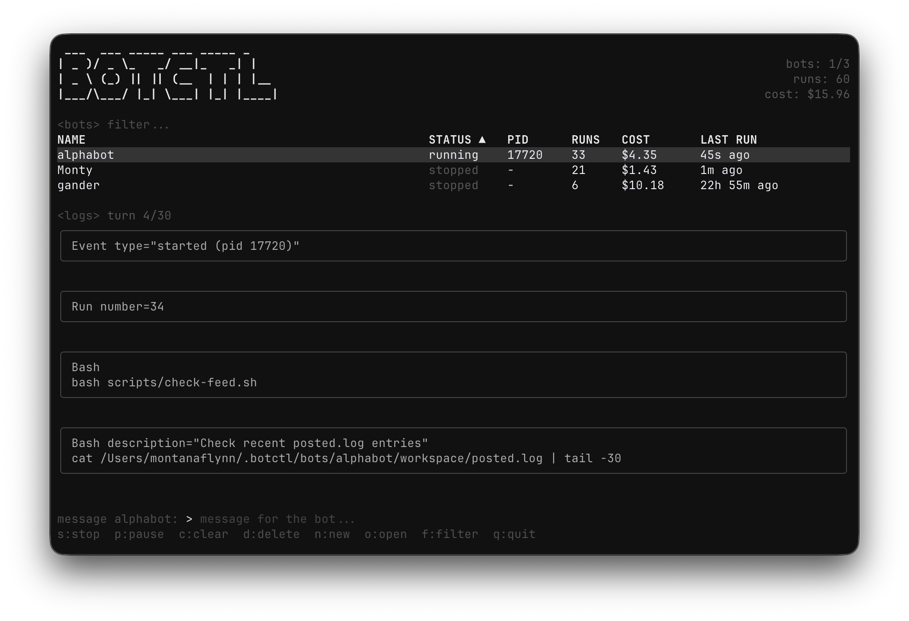

<h1 align="center">botctl</h1>
<p align="center">
  <a href="https://botctl.dev">Website</a> ·
  <a href="https://botctl.dev/docs">Docs</a> ·
  <a href="#install">Install</a> ·
  <a href="https://github.com/montanaflynn/botctl/releases">Releases</a>
</p>

Process manager for autonomous AI agent bots. Run persistent agents from a single CLI with a terminal dashboard, web UI, and declarative configuration.

Pluggable agent backends: runs on <a href="https://claude.com/claude-code">Claude</a> out of the box, or swap in <a href="https://opencode.ai">opencode</a> to use OpenRouter, OpenAI, Gemini, local Ollama, or any other model provider opencode supports.

<p align="center">
  
</p>

## Install

```bash
curl -fsSL https://botctl.dev/install.sh | sh
```

Or with Homebrew:

```bash
brew install montanaflynn/tap/botctl
```

Or with Go:

```bash
go install github.com/montanaflynn/botctl@latest
```

Pre-built binaries for macOS, Linux, and Windows are on the [releases](https://github.com/montanaflynn/botctl/releases) page.

## Quick Start

```bash
# Create a bot (interactive)
botctl create my-bot

# Start the TUI dashboard
botctl

# Or start a specific bot in the background
botctl start my-bot --detach

# Send a message to a running bot
botctl start my-bot --message "check the error logs"

# Run once and exit
botctl start my-bot --once

# View logs
botctl logs my-bot -f

# Pause a running bot (preserves session)
botctl pause my-bot

# Resume a paused bot
botctl play my-bot --turns 20

# Stop (kills process, loses session)
botctl stop my-bot
```

## CLI Commands

| Command | Description |
|---------|-------------|
| `botctl` | Open the TUI dashboard (`--web-ui` for web dashboard, `--port` to set port) |
| `botctl create [name]` | Create a new bot via Claude (`-d` description, `-i` interval, `-m` max turns) |
| `botctl start [name]` | Start a bot (`-d` detach, `-m` message, `--once` single run) |
| `botctl stop [name]` | Stop a bot (no args = stop all) |
| `botctl pause [name]` | Pause a running/sleeping bot (preserves session) |
| `botctl play [name]` | Resume a paused bot (`-t` turns) |
| `botctl list` | List bots with status |
| `botctl status` | Detailed status of all bots |
| `botctl logs [name]` | View logs (`-n` lines, `-f` follow) |
| `botctl delete <name>` | Delete a bot and its data (`-y` skip confirmation) |
| `botctl skills list` | List discovered skills (`--bot` to filter by bot) |
| `botctl skills search <query>` | Search skills.sh for community skills (`-n` limit) |
| `botctl skills add <owner/repo>` | Install skills from a GitHub repo (`--skill`, `--bot`, `--global`) |
| `botctl skills view <name>` | View a skill's SKILL.md and list its files |
| `botctl skills remove <name>` | Remove an installed skill |
| `botctl update` | Self-update to the latest release |

## TUI Keybindings

| Key | Action |
|-----|--------|
| `s` | Start/stop selected bot |
| `p` | Pause/play (pause if running/sleeping, play if paused) |
| `m` / `enter` | Send message to bot |
| `n` | Create new bot |
| `c` | Clear bot context (restart) |
| `d` | Delete bot (with confirmation) |
| `o` | Open bot directory |
| `f` / `tab` | Focus filter bar |
| `j` / `k` | Navigate bot list |
| `q` | Quit |

## BOT.md Configuration

Each bot is defined by a `BOT.md` file with YAML frontmatter and a markdown body:

```markdown
---
name: my-bot
id: my-bot-001
interval_seconds: 300
max_turns: 20
workspace: local
skills_dir: ./skills
log_retention: 30
---

You are an autonomous agent that...
```

### Frontmatter Fields

| Field | Type | Default | Description |
|-------|------|---------|-------------|
| `name` | string | required | Display name |
| `id` | string | folder name | Stable database key (survives folder renames) |
| `interval_seconds` | int | 60 | Seconds between runs |
| `max_turns` | int | 0 (unlimited) | Turn limit per run |
| `workspace` | string | `local` | `local` (per-bot) or `shared` (`~/.botctl/workspace/`) |
| `skills_dir` | string | — | Relative path to skill directories |
| `log_retention` | int | 30 | Number of run logs to keep |
| `env` | map | — | Environment variables (supports `${VAR}` references) |
| `backend` | string | `claude` | Agent runtime: `claude` or `opencode` |
| `model` | string | — | Model ID. Required when `backend: opencode` |
| `provider` | string | — | Provider prefix for opencode (e.g. `openrouter`). Combined as `provider/model` |

The markdown body becomes the bot's system prompt. The configured backend sees it every run.

### Example: opencode backend via OpenRouter

```markdown
---
name: cheap-bot
backend: opencode
provider: openrouter
model: openai/gpt-oss-120b
interval_seconds: 600
max_turns: 5
---

You are a budget-conscious research bot...
```

The opencode backend requires the `opencode` CLI installed and authed with at least one provider (`opencode auth login`).

## How It Works

Bots have four states: **running** (executing an agent turn), **sleeping** (waiting between runs), **paused** (waiting for play/message), and **stopped** (no process).

```
┌─────────────────────────────────────────┐
│              Harness Loop               │
│                                         │
│  1. Reload BOT.md config    → running   │
│  2. Check message queue                 │
│  3. Run agent task (up to max_turns)    │
│  4. Record stats (cost, turns, session) │
│  5. Write log file                      │
│  6. If max_turns hit       → paused     │
│  7. Sleep for interval_seconds          │
│     (woken early by messages/play)      │
│                              → sleeping │
│  8. Repeat                              │
│                                         │
└─────────────────────────────────────────┘
```

Config changes (including `max_turns`) take effect on the next run without restarting.

### Pause / Play

- **Pause** interrupts a running bot or transitions a sleeping bot to paused. The session context is preserved.
- **Play** resumes a paused bot with an editable turn count. Use **Start** to run a stopped bot.
- **Stop** kills the process and loses the session. Use pause to preserve context.
- When a run hits `max_turns`, the bot automatically enters paused state. Press `p` in the TUI to play.

### Skills

Skills are directories containing a `SKILL.md` file with YAML frontmatter (`name` and `description`) and a markdown body. The harness parses frontmatter from all discovered skills and lists them by name and description in the system prompt. The agent loads full skill content on-demand via the Skill tool.

Skills are discovered from three locations (first occurrence of a name wins):

1. `~/.agents/skills/` — cross-agent shared skills
2. `~/.botctl/skills/` — botctl-wide shared skills
3. Bot's `skills_dir` — per-bot skills

```
my-bot/
  BOT.md
  skills/
    api-access/
      SKILL.md
    safety-rules/
      SKILL.md
  workspace/
```

## File Layout

```
~/.botctl/
  botctl.db              # SQLite database
  workspace/             # Shared workspace
  bots/
    my-bot/
      BOT.md             # Bot config + prompt
      skills/            # Skill directories (optional)
        my-skill/
          SKILL.md
      workspace/         # Local workspace
      logs/              # Per-run log files
```

## Web Dashboard

```bash
botctl --web-ui              # default port 4444
botctl --web-ui --port 8080  # custom port
```

## Updates

```bash
botctl update
```

Checks for new releases and replaces the binary in-place.

## License

MIT
